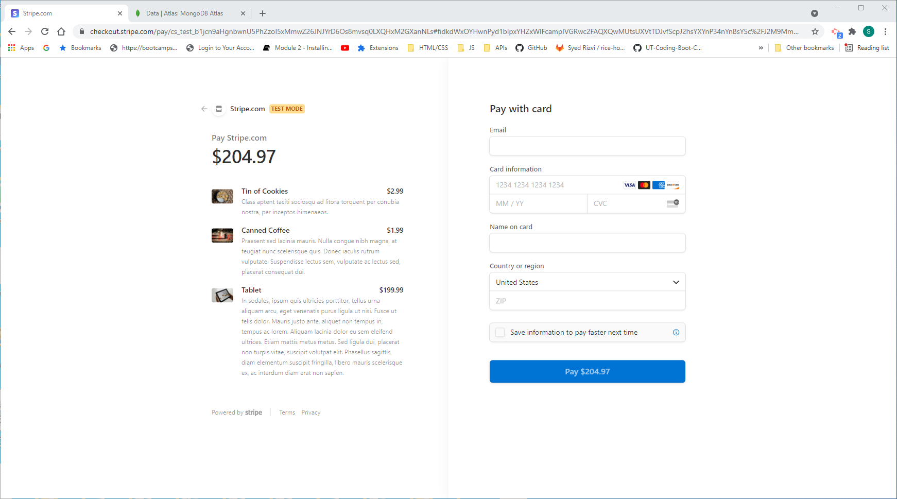

# redus-store
2. Downloaded the required folder from the class activity 26
3. Installed all the required dependencies.
4. installed redux
5. seeded data 
6. Added redux-store 
7. The following is the screen-shot of deployed App

 /img">

9. The following is the heroku deployed url
https://guarded-ravine-66984.herokuapp.com/